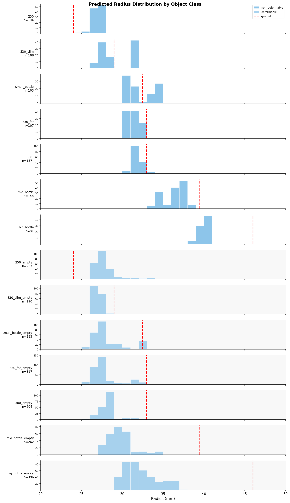

# Radius Prediction from Tactile Point Cloud (PointNet++)

Predicts the radius of grasped cylindrical objects from 3D tactile point cloud data using PointNet++ with surface normals.

## Quick Start

### Prerequisites
```bash
cd ~/develop/inspire_hand_ws
source venv/bin/activate
pip install -r radius_prediction/requirements.txt
```

### Training

```bash
# Train PointNet++ model (saves to checkpoints/best_pointnetpp.pt)
python -m radius_prediction.train_pointnetpp --epochs 100
```

**Output files:**
- `checkpoints/best_pointnetpp.pt` - Best model checkpoint

**Arguments:**
| Argument | Default | Description |
|----------|---------|-------------|
| `--epochs` | 100 | Number of training epochs |
| `--batch_size` | 16 | Batch size |
| `--lr` | 0.001 | Learning rate |
| `--split_file` | `data/splits/default_split.json` | Train/val split |
| `--no_intensity` | - | Don't use intensity channel |
| `--no_normals` | - | Don't use surface normals |

**Expected output:**
```
Train samples: 2601 (78 bags)
Val samples: 808 (23 bags)
Model parameters: 1,465,921

Epoch   1/100 | Train Loss: 0.0998 | Val Loss: 0.0177 | Val RMSE: 2.92mm | Val MAE: 2.48mm
  -> Saved best model (RMSE: 2.92mm)
```

**Training time:** ~7 min/epoch on RTX 4000 Ada GPU

### Evaluation

```bash
# Run evaluation on validation + deformable datasets
python -m radius_prediction.evaluate_all

# Plot from existing CSV (skip inference)
python -m radius_prediction.evaluate_all --plot_only

# Generate summary table only
python -m radius_prediction.evaluate_all --table_only
```

**Output files:**
- `evaluation_results.csv` - Per-sample predictions
- `evaluation_plot.png` - Distribution plot

**Arguments:**
| Argument | Default | Description |
|----------|---------|-------------|
| `--checkpoint` | `checkpoints/best_pointnetpp.pt` | Model path |
| `--output_csv` | `evaluation_results.csv` | Results CSV |
| `--output_plot` | `evaluation_plot.png` | Plot image |
| `--summary_csv` | - | Save summary table to CSV |
| `--plot_only` | - | Skip inference, use existing CSV |
| `--table_only` | - | Only print summary table |

---

## Results (1 Epoch Model)

### Summary Table

| Class | Type | n | GT (mm) | Mean (mm) | Std (mm) | MAE (mm) |
|-------|------|---|---------|-----------|----------|----------|
| 250 | non_deformable | 104 | 24.0 | 26.9 | 0.5 | 2.9 |
| 330_slim | non_deformable | 108 | 29.0 | 29.2 | 1.9 | 1.8 |
| small_bottle | non_deformable | 103 | 32.5 | 32.2 | 1.6 | 1.6 |
| 330_fat | non_deformable | 107 | 33.0 | 31.3 | 0.8 | 1.7 |
| 500 | non_deformable | 157 | 33.0 | 31.7 | 0.6 | 1.3 |
| mid_bottle | non_deformable | 148 | 39.5 | 36.4 | 1.3 | 3.1 |
| big_bottle | non_deformable | 81 | 46.0 | 40.0 | 0.5 | 6.0 |
| 250_empty | deformable | 237 | 24.0 | 27.7 | 1.2 | 3.7 |
| 330_slim_empty | deformable | 190 | 29.0 | 27.1 | 0.3 | 1.9 |
| small_bottle_empty | deformable | 283 | 32.5 | 28.1 | 2.0 | 4.4 |
| 330_fat_empty | deformable | 317 | 33.0 | 27.8 | 1.7 | 5.2 |
| 500_empty | deformable | 204 | 33.0 | 28.2 | 1.1 | 4.8 |
| mid_bottle_empty | deformable | 262 | 39.5 | 29.8 | 1.6 | 9.7 |
| big_bottle_empty | deformable | 396 | 46.0 | 32.2 | 2.0 | 13.8 |
| **OVERALL** | **non_deformable** | **808** | - | - | - | **2.5** |
| **OVERALL** | **deformable** | **1889** | - | - | - | **6.9** |

### Prediction Distribution



**Key observations:**
- Non-deformable (validation): MAE = 2.5mm
- Deformable (all data): MAE = 6.9mm
- Model under-predicts on deformable objects (compressed bottles appear smaller)
- Larger radii show higher error (big_bottle: 6.0mm, big_bottle_empty: 13.8mm MAE)

---

## Model Architecture (PointNet++)

```
Input: 1024 points x 7 channels (xyz + intensity + normal_xyz)
                            |
                            v
+---------------------------------------------------------+
|  SA1: Set Abstraction Layer 1                           |
|  - FPS: select 512 centroids                            |
|  - Ball query: r=0.1, k=32 neighbors per centroid       |
|  - PointNet: MLP(7 -> 64 -> 64 -> 128)                  |
|  Output: 512 points x 128 features                      |
+---------------------------------------------------------+
                            |
                            v
+---------------------------------------------------------+
|  SA2: Set Abstraction Layer 2                           |
|  - FPS: select 128 centroids                            |
|  - Ball query: r=0.2, k=64 neighbors per centroid       |
|  - PointNet: MLP(128 -> 128 -> 128 -> 256)              |
|  Output: 128 points x 256 features                      |
+---------------------------------------------------------+
                            |
                            v
+---------------------------------------------------------+
|  SA3: Set Abstraction Layer 3                           |
|  - FPS: select 32 centroids                             |
|  - Ball query: r=0.4, k=128 neighbors per centroid      |
|  - PointNet: MLP(256 -> 256 -> 512 -> 1024)             |
|  Output: 32 points x 1024 features                      |
+---------------------------------------------------------+
                            |
                            v
+---------------------------------------------------------+
|  Global Max Pooling -> 1024-dim vector                  |
+---------------------------------------------------------+
                            |
                            v
+---------------------------------------------------------+
|  Regression Head                                        |
|  FC(1024 -> 512) -> ReLU -> Dropout(0.3)                |
|  FC(512 -> 256) -> ReLU -> Dropout(0.3)                 |
|  FC(256 -> 1) -> Radius (normalized 0-1)                |
+---------------------------------------------------------+
```

**Input Features (7 channels):**
- `xyz` (3): 3D coordinates of tactile contact points
- `intensity` (1): Pressure/force magnitude from tactile sensor
- `normal_xyz` (3): Surface normals computed via k-NN + PCA (k=30 neighbors)

**Set Abstraction (SA) Layer:**
1. **Farthest Point Sampling (FPS)**: Select N centroids that maximize coverage
2. **Ball Query**: For each centroid, find k neighbors within radius r
3. **PointNet**: Apply shared MLP to each local neighborhood, then max-pool

**Why PointNet++ over PointNet?**
- PointNet uses global max-pooling -> loses local geometric structure
- PointNet++ hierarchically groups points -> captures local curvature patterns
- Critical for radius estimation: local surface curvature encodes cylinder radius

**Model characteristics:**
- **Parameters**: ~1.5M
- **Training time**: ~7 min/epoch on GPU (RTX 4000 Ada)
- **Performance**: 2.5mm MAE on validation, 2.9mm RMSE (1 epoch)

---

## Data Augmentation

```python
# 1. Random Z-axis rotation (cylinders are rotationally symmetric)
theta = random.uniform(0, 2*pi)
rotation_matrix = [[cos(t), -sin(t), 0],
                   [sin(t),  cos(t), 0],
                   [0,       0,      1]]
xyz = xyz @ rotation_matrix.T
normals = normals @ rotation_matrix.T

# 2. Random scale (small range to preserve geometry)
scale = random.uniform(0.9, 1.1)
xyz = xyz * scale
```

**Why this augmentation?**
- **Z-rotation**: Cylinders look the same from any angle around their axis
- **Small scale**: Preserves relative geometry; large scale would change apparent radius
- **No translation**: Points are already centered at origin
- **No point dropout**: Preserves surface continuity needed for normal estimation
- **No jitter**: Tactile sensor noise is already present in real data

---

## Dataset

### Structure
```
training_data/
├── non_deformable/            # Rigid objects (training + validation)
│   ├── record_250_3/          # 24.0mm radius, bag 3
│   ├── record_250_4/          # 24.0mm radius, bag 4
│   ├── record_330_fat_3/      # 33.0mm radius (fat variant)
│   ├── record_330_slim_3/     # 29.0mm radius (slim variant)
│   ├── record_500_3/          # 33.0mm radius cylinder
│   ├── record_small_bottle_3/ # 32.5mm radius
│   ├── record_mid_bottle_3/   # 39.5mm radius
│   └── record_big_bottle_3/   # 46.0mm radius
│
└── deformable/                # Empty bottles (evaluation only)
    ├── record_250_empty_3/
    └── ...
```

Each sample contains:
- `tactile_pointcloud.pcd` - 3D tactile point cloud (~7500-10000 points)
- `camera_rgb.png` - 1280x720 RGB image
- `joint_state.json` - 12 joint angles in radians

### Statistics
- **Non-deformable**: 101 bags, ~4000 samples
- **Deformable**: 69 bags, ~1900 samples
- **Radius range**: 24-46mm
- **Split strategy**: 80/20 bag-level split per class
  - Train: 78 bags (2601 samples)
  - Val: 23 bags (808 samples)
  - Excluded: bags `_1` and `_2` (non-grasping warmup recordings)

**Why bag-level split?** Consecutive frames within a bag are very similar; mixing them causes overfitting.

### Label Mapping
```python
OBJECT_TO_RADIUS = {
    "250": 24.0,           # mm
    "330_fat": 33.0,
    "330_slim": 29.0,
    "500": 33.0,
    "small_bottle": 32.5,
    "mid_bottle": 39.5,
    "big_bottle": 46.0,
}
```

---

## File Structure

```
radius_prediction/
├── README.md                    # This file
├── requirements.txt             # Python dependencies
├── config.py                    # Configuration and hyperparameters
│
├── doc/                         # Documentation assets
│   ├── evaluation_plot.png      # Prediction distribution plot
│   └── evaluation_results.csv   # Evaluation results (per-sample)
│
├── data/
│   ├── pointcloud_dataset.py    # Tactile point cloud (FPS, normalize)
│   ├── pointcloud_dataset_normals.py  # Surface normal computation
│   ├── bag_dataset.py           # Bag-level split dataset
│   ├── generate_split.py        # Generate train/val split JSON
│   └── splits/
│       └── default_split.json   # 80/20 bag-level split
│
├── models/
│   └── pointnetpp.py            # PointNet++ with Set Abstraction
│
├── train_pointnetpp.py          # Training script
├── evaluate_all.py              # Evaluation script
│
└── checkpoints/
    └── best_pointnetpp.pt       # Best model checkpoint
```

---

## References

- **PointNet++**: Qi et al., "PointNet++: Deep Hierarchical Feature Learning on Point Sets", NeurIPS 2017
- **PointNet**: Charles et al., "PointNet: Deep Learning on Point Sets for 3D Classification and Segmentation", CVPR 2017
- **Ge2018**: Ge et al., "Point-to-Point Regression PointNet for 3D Hand Pose Estimation", ECCV 2018 (inspiration for tactile processing)
