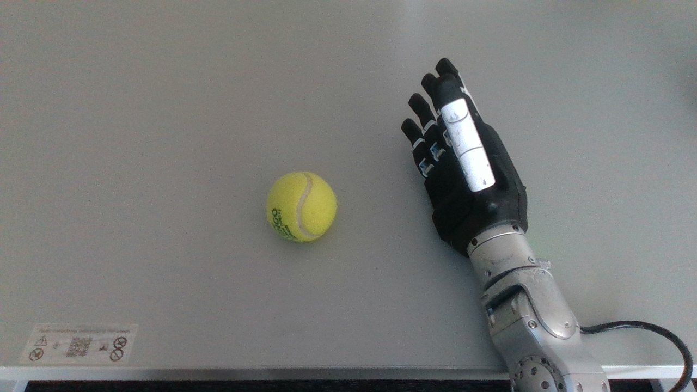
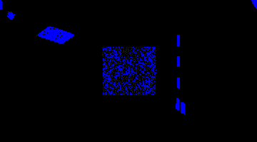
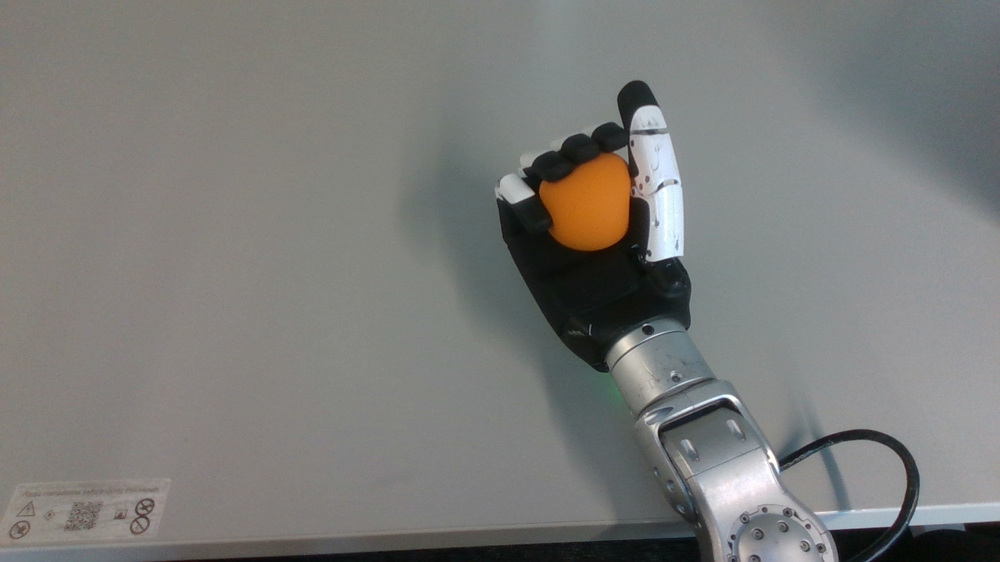
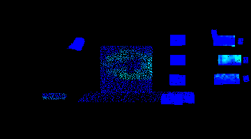
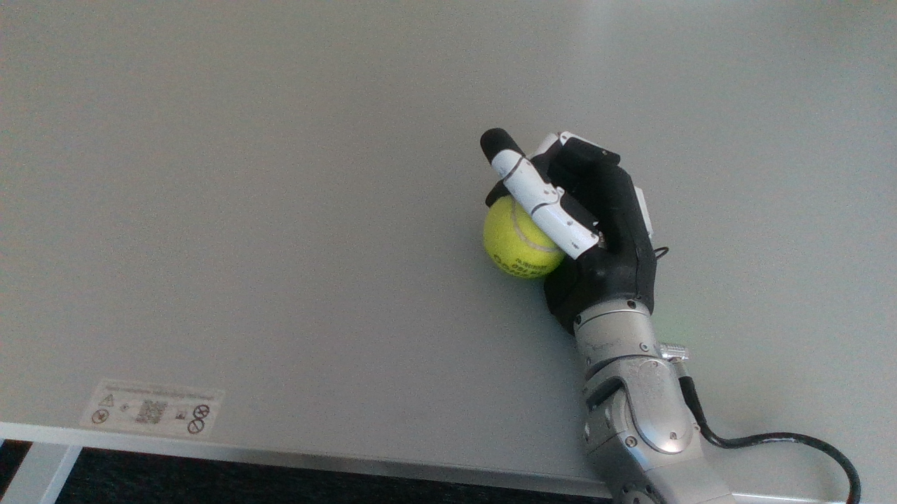
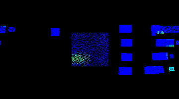
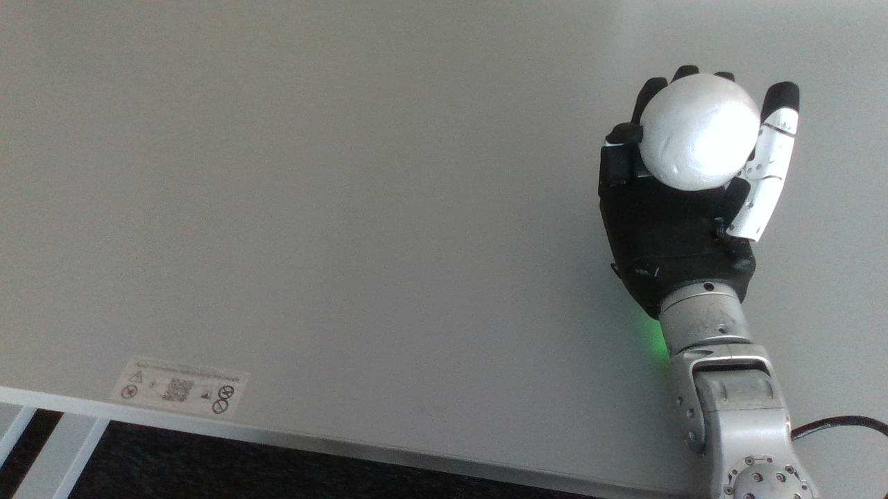
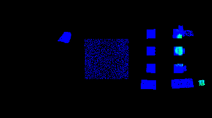

# Data Collection Scripts

Scripts for recording and processing synchronized multi-modal training data from ROS2 bags.

## Overview

This directory contains:
1. **Recording scripts** - Capture live data from the hand during grasps
2. **Processing scripts** - Extract synchronized samples from recorded bags
3. **Visualization scripts** - Inspect extracted samples

The pipeline records ROS2 bag files during grasping operations, then extracts synchronized samples of:
- Camera RGB images
- Tactile sensor heatmaps
- Tactile point clouds (with intensity)
- Hand actuator states
- Joint states

Bags are automatically classified as **deformable** (empty/soft objects) or **non-deformable** (filled/rigid objects) based on filename.

## Object Radii

Ground truth radii for all grasped objects.

| Object | Radius (mm) | Notes |
|--------|-------------|-------|
| 250 | 24.0 | Cylinder |
| 330_fat | 33.0 | Cylinder |
| 330_slim | 29.0 | Cylinder |
| 500 | 33.0 | Cylinder |
| small_bottle | 32.5 | |
| mid_bottle | 39.5 | |
| big_bottle | 46.0 | |
| tenis_ball | 32.0 | 64mm diameter |
| orange_ball | 29.4 | 58.8mm diameter |
| white_ball | 38.5 | 77mm diameter |

## Scripts

### `record.sh`

Records live grasp data from the hand to ROS2 bag format.

**Usage:**
```bash
# Record to specified directory
scripts/record.sh <output_directory>

# Example: Create timestamped recording
scripts/record.sh grasp_tests/test_cylinder_$(date +%Y%m%d_%H%M%S)
```

**What it records:**
- Hand state, control, and tactile data
- Tactile point clouds (3D visualization with intensity)
- Cylinder projection (2D unwrapped tactile heatmap)
- Joint states and TF transforms
- Camera RGB + depth (if `ROS_DOMAIN_ID=1`)
- Camera point cloud

**Prerequisites:**
- Hand driver running: `ros2 launch inspire_hand_ros2 inspire_hand.launch.py`
- (Optional) Camera topics visible: `export ROS_DOMAIN_ID=1`

**Playback:**
```bash
ros2 bag play grasp_tests/test_cylinder_20260331_150000
```

### `process_bags.sh`

Main orchestrator script that processes all bags in `test_bags/`.

**Usage:**
```bash
# Process all bags
./scripts/process_bags.sh

# Process a single bag
./scripts/process_bags.sh record_250_1
```

**Configuration** (edit script to change):
```bash
SAMPLE_INTERVAL=0.081  # Seconds between samples (~30 samples per 5s bag)
```

**Classification:**
- Bags with `_empty` in name → `training_data/deformable/`
- All other bags → `training_data/non_deformable/`

### `visualize_sample.py`

Interactive visualizer for inspecting extracted samples.

**Usage:**
```bash
./scripts/visualize_sample.py training_data/non_deformable/record_250_1/sample_0000
```

**Controls:**
1. Camera RGB image → press any key to continue
2. Tactile colormap → press any key to continue
3. Tactile point cloud viewer:
   - **A** - Toggle between RGB and Intensity coloring
   - **R** - Toggle between Filtered and Raw point cloud
   - **Q** - Quit
4. Camera point cloud viewer (if available):
   - **Q** - Quit


## Output Structure

```
training_data/
├── README.md                      # Dataset documentation
├── deformable/                    # Bags with "_empty" in name
│   └── record_250_empty_1/
│       ├── sample_0000/
│       │   ├── camera_rgb.png            # 1280x720 RGB camera image
│       │   ├── camera_pointcloud.pcd     # Depth camera point cloud (CUDA processed)
│       │   ├── tactile_colormap.png      # 360x200 tactile heatmap
│       │   ├── hand_state.json           # Actuator positions, forces, etc.
│       │   ├── joint_state.json          # Joint angles
│       │   ├── tactile_pointcloud.pcd    # 3D point cloud (grey filtered)
│       │   └── tactile_pointcloud_raw.pcd # 3D point cloud (unfiltered)
│       ├── sample_0001/
│       └── ...
└── non_deformable/                # All other bags
    └── record_250_1/
        └── ...
```

## Data Formats

### hand_state.json
```json
{
  "timestamp": {"sec": 1774010202, "nanosec": 21600595},
  "position_actual": [97, 73, 19, 93, 243, 813],
  "angle_actual": [999, 998, 999, 998, 1000, 492],
  "force_actual": [-78, 4, 5, 2, 17, 36],
  "current": [0, 0, 0, 0, 0, 0],
  "status": [2, 2, 2, 2, 2, 2],
  "error": [0, 0, 0, 0, 0, 0],
  "temperature": [56, 56, 56, 58, 50, 58]
}
```

**Field Ranges:**
- `position_actual`: 0-2000 (actuator stroke)
- `angle_actual`: 0-1000 (normalized finger angle)
- `force_actual`: -4000 to 4000 grams
- `current`: 0-2000 mA
- `temperature`: 0-100 °C

### joint_state.json
```json
{
  "timestamp": {"sec": 1774010202, "nanosec": 54589470},
  "name": ["right_little_1_joint", "right_ring_1_joint", ...],
  "position": [0.0, -0.0, 0.0, ...],
  "velocity": [],
  "effort": []
}
```

### tactile_pointcloud.pcd
Binary PCD v0.7 format with fields:
- `x, y, z` (float32) - 3D coordinates in meters
- `rgb` (packed float32) - Point color
- `intensity` (float32) - Tactile pressure (0-4095 raw ADC)

## ROS2 Topics Sampled

| Topic | Type | Rate | Output |
|-------|------|------|--------|
| `/camera/camera/color/image_raw` | Image | ~10 Hz | camera_rgb.png |
| `/cylinder_projection/unwrapped_colormap` | Image | ~10 Hz | tactile_colormap.png |
| `/inspire_hand/inspire_hand_node/state` | InspireHandState | ~30 Hz | hand_state.json |
| `/joint_states` | JointState | ~10 Hz | joint_state.json |
| `/inspire_hand/tactile_pointcloud` | PointCloud2 | ~10 Hz | tactile_pointcloud.pcd |

## Sample Data

### Deformable (Empty/Soft Objects)

#### Tennis Ball (Empty) - 365 samples
**Example: `record_tenis_ball_empty_1/sample_0010`**

| Camera RGB | Tactile Colormap |
|-----------|------------------|
|  |  |

#### Orange Ball (Empty) - 555 samples
**Example: `record_orange_ball_empty_10/sample_0010`**

| Camera RGB | Tactile Colormap |
|-----------|------------------|
|  |  |

#### Cylinder 250mm (Empty)
**Example: `record_250_empty_10/sample_0005`**

| Camera RGB | Tactile Colormap |
|-----------|------------------|
|  |  |

### Non-Deformable (Rigid/Filled Objects)

#### Tennis Ball (Rigid) - 532 samples
**Example: `record_tenis_ball_10/sample_0010`**

| Camera RGB | Tactile Colormap |
|-----------|------------------|
|  |  |

#### White Ball (Rigid) - 590 samples
**Example: `record_white_ball_10/sample_0010`**

| Camera RGB | Tactile Colormap |
|-----------|------------------|
|  |  |

#### Cylinder 250mm (Rigid)
**Example: `record_250_12/sample_0000`**

| Camera RGB | Tactile Colormap |
|-----------|------------------|
|  |  |

**View more samples:**
```bash
# Deformable balls
./scripts/visualize_sample.py training_data/deformable/record_tenis_ball_empty_1/sample_0010
./scripts/visualize_sample.py training_data/deformable/record_orange_ball_empty_10/sample_0010

# Non-deformable balls
./scripts/visualize_sample.py training_data/non_deformable/record_tenis_ball_10/sample_0010
./scripts/visualize_sample.py training_data/non_deformable/record_white_ball_10/sample_0010

# Cylinders
./scripts/visualize_sample.py training_data/deformable/record_250_empty_10/sample_0005
./scripts/visualize_sample.py training_data/non_deformable/record_250_12/sample_0000
```

## Requirements

- ROS2 Humble
- Python packages: `opencv-python`, `numpy`, `open3d`, `pyyaml`
- Built workspace: `colcon build`
- Install dependencies: `pip install -r scripts/requirements.txt`

## Collected Dataset Statistics

| Metric | Value |
|--------|-------|
| Total Samples | 6,087 |
| Total Bags | 198 |
| Dataset Size | 11.08 GB |
| Sample Interval | 0.081s (~30 samples per bag) |

### Ball Object Statistics

| Object Type | Category | Bags | Samples |
|-------------|----------|------|---------|
| Tennis Ball (empty) | Deformable | 9 | 365 |
| Orange Ball (empty) | Deformable | 13 | 555 |
| Tennis Ball (rigid) | Non-Deformable | 13 | 532 |
| White Ball (rigid) | Non-Deformable | 13 | 590 |
| **Ball Total** | | **48** | **2,042** |

**Note:** All modalities are complete except `camera_pointcloud.pcd`, which is missing from 306 samples (5.0%) due to sparse depth camera recording in source bags. See `training_data/README.md` for affected bags.
