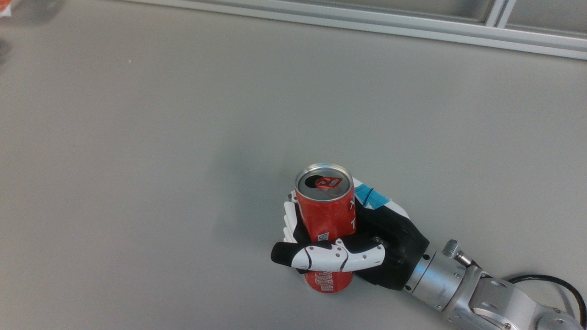
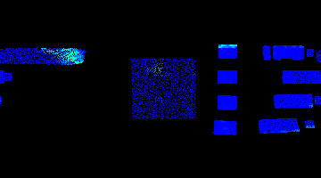
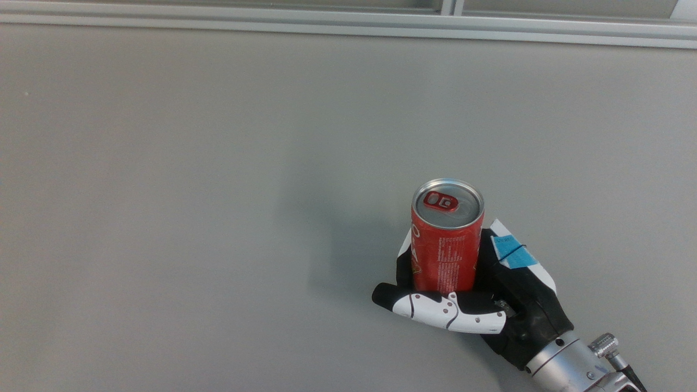
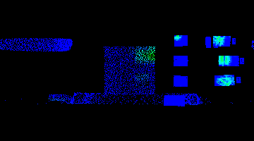

# Data Collection Scripts

Scripts for extracting synchronized multi-modal training data from ROS2 bags.

## Overview

The pipeline processes ROS2 bag files containing robot hand grasping data and extracts synchronized samples of:
- Camera RGB images
- Tactile sensor heatmaps
- Tactile point clouds (with intensity)
- Hand actuator states
- Joint states

Bags are automatically classified as **deformable** (empty/soft objects) or **non-deformable** (filled/rigid objects) based on filename.

## Scripts

### `process_bags.sh`

Main orchestrator script that processes all bags in `test_bags/`.

**Usage:**
```bash
# Process all bags
./scripts/process_bags.sh

# Process a single bag
./scripts/process_bags.sh record_250_1
```

**Configuration** (edit script to change):
```bash
SAMPLE_INTERVAL=0.081  # Seconds between samples (~30 samples per 5s bag)
```

**Classification:**
- Bags with `_empty` in name → `training_data/deformable/`
- All other bags → `training_data/non_deformable/`

### `visualize_sample.py`

Interactive visualizer for inspecting extracted samples.

**Usage:**
```bash
./scripts/visualize_sample.py training_data/non_deformable/record_250_1/sample_0000
```

**Controls:**
1. Camera RGB image → press any key to continue
2. Tactile colormap → press any key to continue
3. Tactile point cloud viewer:
   - **A** - Toggle between RGB and Intensity coloring
   - **R** - Toggle between Filtered and Raw point cloud
   - **Q** - Quit
4. Camera point cloud viewer (if available):
   - **Q** - Quit

### `generate_trajectory_yaml.py`

Converts a bag sequence (samples) into a trajectory YAML file for simulation playback.

**Usage:**
```bash
# Generate trajectory from a single bag sequence
./scripts/generate_trajectory_yaml.py training_data/deformable/record_250_empty_10 output.yaml
./scripts/generate_trajectory_yaml.py training_data/non_deformable/record_250_12 output.yaml
```

**Output:** YAML file with:
- Joint names list
- Per-frame: frame number, image path, joint positions (radians)

### `generate_all_trajectories.sh`

Batch processes all bags in `training_data/` to generate trajectory YAMLs.

**Usage:**
```bash
# Generate YAMLs for all 198 bags + combined datasets by category
./scripts/generate_all_trajectories.sh
```

**Output:**
- `training_data/trajectories/deformable/*.yaml` (83 individual files)
- `training_data/trajectories/non_deformable/*.yaml` (115 individual files)
- `training_data/deformable_trajectories.yaml` (all deformable frames combined)
- `training_data/non_deformable_trajectories.yaml` (all non-deformable frames combined)

### `combine_trajectories.py`

Combines individual trajectory YAMLs from a directory into a single flat dataset file.
Stacks all frames from all trajectories sequentially.

**Usage:**
```bash
# Combine deformable trajectories
./scripts/combine_trajectories.py training_data/trajectories/deformable deformable_combined.yaml

# Combine non-deformable trajectories
./scripts/combine_trajectories.py training_data/trajectories/non_deformable non_deformable_combined.yaml
```

**Output:** Single YAML with all frames stacked together:
```yaml
joints: [right_little_1_joint, right_ring_1_joint, ...]
frames:
- frame: 0
  image: training_data/deformable/record_250_empty_1/sample_0000/camera_rgb.png
  joint_positions_rad: {...}
- frame: 1
  image: training_data/deformable/record_250_empty_1/sample_0001/camera_rgb.png
  joint_positions_rad: {...}
...
```

### `fix_yaml_paths.sh`

Fixes absolute paths in YAML files to relative paths.

**Usage:**
```bash
# Fix all YAMLs in a directory
./scripts/fix_yaml_paths.sh yamls/

# Fix a single YAML file
./scripts/fix_yaml_paths.sh yamls/deformable.yaml

# Custom path replacement
./scripts/fix_yaml_paths.sh yamls/ '/old/path/' 'new/path/'
```

**Default:** Replaces `/home/analog/develop/inspire_hand_ws/scripts/../training_data/` with `training_data/`

## Output Structure

```
training_data/
├── README.md                      # Dataset documentation
├── deformable/                    # Bags with "_empty" in name
│   └── record_250_empty_1/
│       ├── sample_0000/
│       │   ├── camera_rgb.png            # 1280x720 RGB camera image
│       │   ├── camera_pointcloud.pcd     # Depth camera point cloud (CUDA processed)
│       │   ├── tactile_colormap.png      # 360x200 tactile heatmap
│       │   ├── hand_state.json           # Actuator positions, forces, etc.
│       │   ├── joint_state.json          # Joint angles
│       │   ├── tactile_pointcloud.pcd    # 3D point cloud (grey filtered)
│       │   └── tactile_pointcloud_raw.pcd # 3D point cloud (unfiltered)
│       ├── sample_0001/
│       └── ...
└── non_deformable/                # All other bags
    └── record_250_1/
        └── ...
```

## Data Formats

### hand_state.json
```json
{
  "timestamp": {"sec": 1774010202, "nanosec": 21600595},
  "position_actual": [97, 73, 19, 93, 243, 813],
  "angle_actual": [999, 998, 999, 998, 1000, 492],
  "force_actual": [-78, 4, 5, 2, 17, 36],
  "current": [0, 0, 0, 0, 0, 0],
  "status": [2, 2, 2, 2, 2, 2],
  "error": [0, 0, 0, 0, 0, 0],
  "temperature": [56, 56, 56, 58, 50, 58]
}
```

**Field Ranges:**
- `position_actual`: 0-2000 (actuator stroke)
- `angle_actual`: 0-1000 (normalized finger angle)
- `force_actual`: -4000 to 4000 grams
- `current`: 0-2000 mA
- `temperature`: 0-100 °C

### joint_state.json
```json
{
  "timestamp": {"sec": 1774010202, "nanosec": 54589470},
  "name": ["right_little_1_joint", "right_ring_1_joint", ...],
  "position": [0.0, -0.0, 0.0, ...],
  "velocity": [],
  "effort": []
}
```

### tactile_pointcloud.pcd
Binary PCD v0.7 format with fields:
- `x, y, z` (float32) - 3D coordinates in meters
- `rgb` (packed float32) - Point color
- `intensity` (float32) - Tactile pressure (0-4095 raw ADC)

## ROS2 Topics Sampled

| Topic | Type | Rate | Output |
|-------|------|------|--------|
| `/camera/camera/color/image_raw` | Image | ~10 Hz | camera_rgb.png |
| `/cylinder_projection/unwrapped_colormap` | Image | ~10 Hz | tactile_colormap.png |
| `/inspire_hand/inspire_hand_node/state` | InspireHandState | ~30 Hz | hand_state.json |
| `/joint_states` | JointState | ~10 Hz | joint_state.json |
| `/inspire_hand/tactile_pointcloud` | PointCloud2 | ~10 Hz | tactile_pointcloud.pcd |

## Sample Data

### Deformable (Empty/Soft Objects)
**Example: `record_250_empty_10/sample_0005`**

| Camera RGB | Tactile Colormap |
|-----------|------------------|
|  |  |

### Non-Deformable (Rigid/Filled Objects)
**Example: `record_250_12/sample_0000`**

| Camera RGB | Tactile Colormap |
|-----------|------------------|
|  |  |

**View more samples:**
```bash
./scripts/visualize_sample.py training_data/deformable/record_250_empty_10/sample_0000
./scripts/visualize_sample.py training_data/deformable/record_250_empty_10/sample_0005
./scripts/visualize_sample.py training_data/deformable/record_250_empty_10/sample_0010
./scripts/visualize_sample.py training_data/non_deformable/record_250_12/sample_0000
./scripts/visualize_sample.py training_data/non_deformable/record_250_12/sample_0002
```

## Requirements

- ROS2 Humble
- Python packages: `opencv-python`, `numpy`, `open3d`, `pyyaml`
- Built workspace: `colcon build`
- Install dependencies: `pip install -r scripts/requirements.txt`

## Collected Dataset Statistics

| Metric | Value |
|--------|-------|
| Total Samples | 6,137 |
| Deformable Samples | 2,281 |
| Non-deformable Samples | 3,856 |
| Total Bags | 198 |
| Deformable Bags | 83 |
| Non-deformable Bags | 115 |
| Dataset Size | 8.9 GB |
| Sample Interval | 0.081s |
| Samples per Bag | ~30 |
| Bag Duration | ~5 seconds |

See `training_data/README.md` for full dataset documentation including data ranges and hardware specs.
