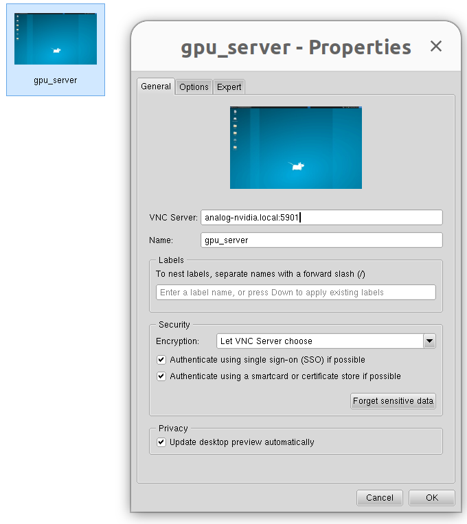

# Inspire Hand Workspace - Quick Start Guide

Complete ROS2 workspace for the **RH56DFTP Dexterous Hand** with tactile sensing, grasp control, and neural network-based object radius prediction.

## Connecting to the Server

Connect to the GPU server using VNC while connected to the **ADI-ROBO-WLAN** network:



**Credentials:**
- Host: `analog-nvidia.local` or check network/ip
- User: `analog`
- Password: `analog`

Once connected via VNC, open a terminal and navigate to the workspace:
```bash
cd ~/develop/inspire_hand_ws
```

---

## Prerequisites

### Hardware Requirements

**CRITICAL**: Before starting, ensure:

1. **Connected to ADI-ROBO-WLAN WiFi**
2. **Server ethernet cable is connected** (connects to robot arm and hand)
3. **Hardware is powered on** (24V supply for hand)

### Verify Hardware Connectivity

**Ping the dexterous hand:**
```bash
ping 192.168.123.211
# Should respond with: 64 bytes from 192.168.123.211: icmp_seq=...
```

If either ping fails:
- Check that you're on **ADI-ROBO-WLAN**
- Verify **ethernet cable is connected** to server
- Check that hardware is powered on (24V supply for hand)

---

## Quick Start: Launch the Hand

### 1. Source ROS2 Environment

```bash
cd ~/develop/inspire_hand_ws
source /opt/ros/humble/setup.bash
source install/setup.bash
```

**Important**: If you want to see RealSense camera topics, set:
```bash
export ROS_DOMAIN_ID=1
```
This allows the camera launch on a separate ROS domain to be visible.

### 2. Launch the Hand Driver

**Terminal 1 - Hand Driver:**
```bash
ros2 launch inspire_hand_ros2 inspire_hand.launch.py
```

This starts:
- Modbus TCP connection to hand (192.168.123.211:6000)
- State publisher (100 Hz): joint angles, forces, positions
- Tactile publisher (50 Hz): 1062 sensor readings
- Grasp controller with slip detection
- Services and actions for control

**Expected output:**
```
[INFO] [inspire_hand_node]: Connected to hand at 192.168.123.211:6000
[INFO] [inspire_hand_node]: Running calibration sequence...
[INFO] [inspire_hand_node]: Calibration complete. Hand ready.
```

### 3. Launch Tactile Point Cloud Visualization

**Terminal 2 - Tactile Visualization:**
```bash
ros2 launch inspire_hand_ros2 tactile_pointcloud.launch.py
```

This provides:
- **3D tactile point cloud** (~20k colored points showing pressure)
- **Cylinder projection** (2D unwrapped tactile image)
- **Reference cylinder mesh** (for grasp visualization)

**View in RViz:**
```bash
# Terminal 3
rviz2
# Then: File → Open Config → navigate to:
# install/inspire_hand_description/share/inspire_hand_description/rviz/tactile_pointcloud.rviz
```

---

## Key ROS2 Topics

### Hand State & Control

| Topic | Type | Rate | Description |
|-------|------|------|-------------|
| `/inspire_hand/inspire_hand_node/state` | `InspireHandState` | 100 Hz | Joint angles, forces, positions |
| `/inspire_hand/inspire_hand_node/touch` | `InspireHandTouch` | 50 Hz | 1062 tactile sensor values (0-4095) |
| `/inspire_hand/inspire_hand_node/control` | `InspireHandControl` | - | Control commands (subscribe) |
| `/inspire_hand/inspire_hand_node/grasp_status` | `GraspStatus` | 50 Hz | Grasp state machine status |

### Tactile Point Cloud

| Topic | Type | Rate | Description |
|-------|------|------|-------------|
| `/inspire_hand/tactile_pointcloud` | `PointCloud2` | 50 Hz | 3D tactile visualization (~20k points) |
| `/cylinder_projection/projected_pointcloud` | `PointCloud2` | 50 Hz | Points projected onto cylinder |
| `/cylinder_projection/unwrapped_image` | `Image` | 50 Hz | 2D unwrapped tactile heatmap |

### Robot Description

| Topic | Type | Rate | Description |
|-------|------|------|-------------|
| `/joint_states` | `JointState` | 50 Hz | URDF joint angles for visualization |
| `/robot_description` | `String` | Latched | Full URDF model |
| `/tf` | `TFMessage` | 50 Hz | Dynamic transforms |
| `/tf_static` | `TFMessage` | Latched | Static transforms |

### Camera Topics (RealSense D435i)

**Set `export ROS_DOMAIN_ID=1` to see these:**

| Topic | Type | Description |
|-------|------|-------------|
| `/camera/camera/color/image_raw` | `Image` | RGB camera (1280×720) |
| `/camera/camera/depth/image_rect_raw` | `Image` | Depth image |
| `/camera/camera/aligned_depth_to_color/image_raw` | `Image` | Depth aligned to RGB |
| `/processed_pointcloud` | `PointCloud2` | Camera depth point cloud |

---

## Recording Data

### Using record.sh Script

The `scripts/record.sh` script records all relevant topics for grasp analysis:

```bash
# Record to default location
scripts/record.sh <output_directory>

# Example:
scripts/record.sh grasp_tests/test_cylinder_$(date +%Y%m%d_%H%M%S)
```

**What it records:**
- Hand state, control, tactile data
- Tactile point clouds (3D visualization)
- Cylinder projection (2D unwrapped)
- Joint states and TF transforms
- Camera RGB + depth (if ROS_DOMAIN_ID=1)
- Camera point cloud

**Playback:**
```bash
ros2 bag play grasp_tests/test_cylinder_20260331_150000
```

---

## Testing the Hand

### Execute a Grasp

**Power grasp (all fingers):**
```bash
ros2 service call /inspire_hand/inspire_hand_node/grasp inspire_hand_ros2/srv/Grasp \
  "{grasp_type: 'power', target_force: 300, speed: 0.1}"
```

**Pinch grasp (thumb + index):**
```bash
ros2 service call /inspire_hand/inspire_hand_node/grasp inspire_hand_ros2/srv/Grasp \
  "{grasp_type: 'pinch', target_force: 300, speed: 0.1}"
```

**Release (open hand):**
```bash
ros2 service call /inspire_hand/inspire_hand_node/release inspire_hand_ros2/srv/Release \
  "{speed: 0.5}"
```

### Monitor Hand State

**Watch joint angles:**
```bash
ros2 topic echo /inspire_hand/inspire_hand_node/state
```

**Watch tactile data:**
```bash
ros2 topic echo /inspire_hand/inspire_hand_node/touch
```

**Check topic rates:**
```bash
ros2 topic hz /inspire_hand/inspire_hand_node/state
# Expected: ~100 Hz

ros2 topic hz /inspire_hand/tactile_pointcloud
# Expected: ~50 Hz
```

---

## Package Documentation

This workspace contains two ROS2 packages:

### 1. inspire_hand_ros2
**Full driver package with grasp control and tactile sensing.**

📖 **[Read Full Documentation →](inspire_hand_ros2/README.md)**

Key features:
- 6-DOF position, angle, force, speed control
- 1062 tactile sensors with real-time feedback
- Human-inspired grasp controller (Romano et al. IEEE TRO 2011)
- Weber's law slip detection (12% threshold)
- Grasp presets: power, pinch, precision, cylindrical, hook
- Action server with real-time feedback
- 2D Qt visualizer and 3D point cloud

### 2. inspire_hand_description
**URDF models, meshes, and visualization for RH56DFTP hand.**

📖 **[Read Full Documentation →](inspire_hand_description/README.md)**

Key features:
- Accurate kinematics (6 DOF + mimic joints)
- High-quality STL meshes for all links
- Tactile sensor mesh mapping
- RViz configurations
- 3D tactile point cloud architecture
- Left and right hand models

---

## Typical Workflow

### 1. Connect and Launch
```bash
# Connect via VNC viewer to analog-nvidia.local
# User: analog, Password: analog

# Open terminal and navigate to workspace
cd ~/develop/inspire_hand_ws

# Source environment
source /opt/ros/humble/setup.bash
source install/setup.bash
export ROS_DOMAIN_ID=1  # For camera topics

# Launch hand driver (Terminal 1)
ros2 launch inspire_hand_ros2 inspire_hand.launch.py

# Launch visualization (Terminal 2)
ros2 launch inspire_hand_ros2 tactile_pointcloud.launch.py
```

### 2. Test Hardware
```bash
# Terminal 3: Verify topics
ros2 topic list

# Verify hand state
ros2 topic echo /inspire_hand/inspire_hand_node/state --once

# Verify tactile data
ros2 topic echo /inspire_hand/inspire_hand_node/touch --once

# Test grasp
ros2 service call /inspire_hand/inspire_hand_node/grasp inspire_hand_ros2/srv/Grasp \
  "{grasp_type: 'power', target_force: 300, speed: 0.1}"
```

### 3. Record Data
```bash
# Terminal 4: Start recording
scripts/record.sh grasp_tests/recording_$(date +%Y%m%d_%H%M%S)

# Perform grasps while recording...

# Stop recording (Ctrl+C after desired duration)
```

### 4. Analyze Data
```bash
# Play back recording
ros2 bag play grasp_tests/recording_20260331_150000

# Or extract to dataset format for neural networks
# See: radius_prediction/README.md
```

---

## Troubleshooting

### Cannot ping hand (192.168.123.211)
1. Verify you're on **ADI-ROBO-WLAN** WiFi
2. Check **ethernet cable is connected** to server
3. Verify hand is powered (24V supply, green LED on)
4. Try: `sudo systemctl restart NetworkManager`

### Hand driver fails to connect
```
[ERROR] [inspire_hand_node]: Connection failed: [Errno 111] Connection refused
```

**Solutions:**
- Verify ping to 192.168.123.211 works
- Check hand is powered on
- Restart hand power supply
- Check firewall: `sudo ufw status`

### No tactile point cloud in RViz
1. Verify node is running:
   ```bash
   ros2 node list | grep tactile
   ```

2. Check topic is publishing:
   ```bash
   ros2 topic hz /inspire_hand/tactile_pointcloud
   ```

3. In RViz, check:
   - Fixed Frame = `base_footprint`
   - Add PointCloud2 display
   - Topic = `/inspire_hand/tactile_pointcloud`
   - Size = 0.002 (or adjust for visibility)

### Cannot see camera topics
**Solution:** Set ROS domain ID before sourcing:
```bash
export ROS_DOMAIN_ID=1
source install/setup.bash
ros2 topic list | grep camera
```

### Hand not moving after launch
The driver runs calibration on startup. If fingers don't move:
- Check status codes:
  ```bash
  ros2 topic echo /inspire_hand/inspire_hand_node/state --once
  # Look for status[i] values (should be 2 = position reached)
  ```
- Restart node to re-run calibration
- Power cycle hand if persistent

---

## Build Instructions

If you need to rebuild the workspace:

```bash
cd ~/develop/inspire_hand_ws

# Clean previous build
rm -rf build/ install/ log/

# Build all packages
colcon build

# Or build specific packages
colcon build --packages-select inspire_hand_ros2
colcon build --packages-select inspire_hand_description

# Source workspace
source install/setup.bash
```

---

## Additional Resources

- **ROS2 Humble Documentation**: https://docs.ros.org/en/humble/
- **RH56DFTP User Manual**: `src/inspire_hand_description/rh56dftp_manual.txt`
- **Grasp Algorithm Paper**: Romano et al., "Human-Inspired Robotic Grasp Control With Tactile Sensing", IEEE TRO 2011
- **PointNet Paper**: Charles et al., "PointNet: Deep Learning on Point Sets", CVPR 2017

---

## Summary Cheat Sheet

```bash
# 1. CONNECT via VNC
# Use VNC viewer → analog-nvidia.local (user: analog, password: analog)
# Open terminal and navigate to workspace:
cd ~/develop/inspire_hand_ws

# 2. VERIFY NETWORK
ping 192.168.123.211  # Dexterous hand

# 3. SOURCE
source /opt/ros/humble/setup.bash
source install/setup.bash
export ROS_DOMAIN_ID=1  # For camera

# 4. LAUNCH (Terminal 1)
ros2 launch inspire_hand_ros2 inspire_hand.launch.py

# 5. VISUALIZE (Terminal 2)
ros2 launch inspire_hand_ros2 tactile_pointcloud.launch.py

# 6. RECORD (Terminal 3)
scripts/record.sh grasp_tests/test_$(date +%Y%m%d_%H%M%S)

# 7. TEST GRASP (Terminal 4)
ros2 service call /inspire_hand/inspire_hand_node/grasp inspire_hand_ros2/srv/Grasp \
  "{grasp_type: 'power', target_force: 300, speed: 0.1}"
```

---

**Questions?** Check the detailed documentation in:
- [inspire_hand_ros2/README.md](inspire_hand_ros2/README.md)
- [inspire_hand_description/README.md](inspire_hand_description/README.md)
- [../radius_prediction/README.md](../radius_prediction/README.md)
