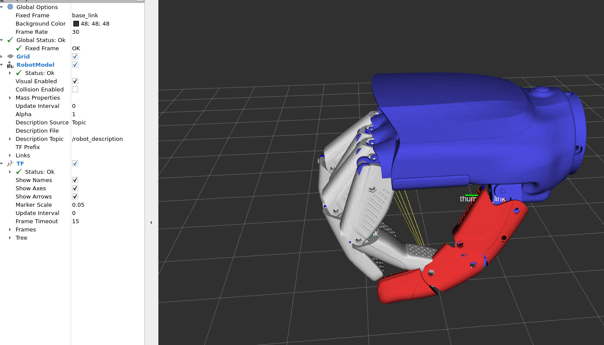

# Inspire Hand Description

ROS2 package containing URDF models and meshes for the Inspire Robotics RH56DFTP dexterous hand.

## Usage

Visualize the hand URDF in RViz:

```bash
ros2 launch inspire_hand_description display.launch.py
```

### Launch Arguments

| Argument | Default | Description |
|----------|---------|-------------|
| `hand`   | `right` | Which hand to display: `right` or `left` |
| `urdf`   | `ref`   | URDF variant: `parts` (individual meshes) or `ref` (reference joint structure) |
| `gui`    | `true`  | Show joint_state_publisher_gui |
| `rviz`   | `true`  | Launch RViz |

### Examples

```bash
# Display right hand with parts meshes
ros2 launch inspire_hand_description display.launch.py urdf:=parts

# Display left hand
ros2 launch inspire_hand_description display.launch.py hand:=left

# Display without GUI sliders
ros2 launch inspire_hand_description display.launch.py gui:=false
```

## Link Structure



The URDF defines the following link hierarchy from `base_link`:
- Thumb: `thumb_1_link` -> `thumb_2_link` -> `thumb_3_link`
- Index: `index_1_link` -> `index_2_link` -> `index_3_link`
- Middle: `middle_1_link` -> `middle_2_link` -> `middle_3_link`
- Ring: `ring_1_link` -> `ring_2_link` -> `ring_3_link`
- Little: `little_1_link` -> `little_2_link` -> `little_3_link`

## Package Structure

```
inspire_hand_description/
├── doc/                    # Documentation and images
├── inspire_R1/             # Original CAD files (STEP, PDF)
├── launch/                 # ROS2 launch files
├── meshes/                 # STL mesh files
│   ├── left/
│   └── right/
├── rviz/                   # RViz configuration
├── scripts/                # STEP to URDF conversion tools
└── urdf/                   # URDF model files
```
