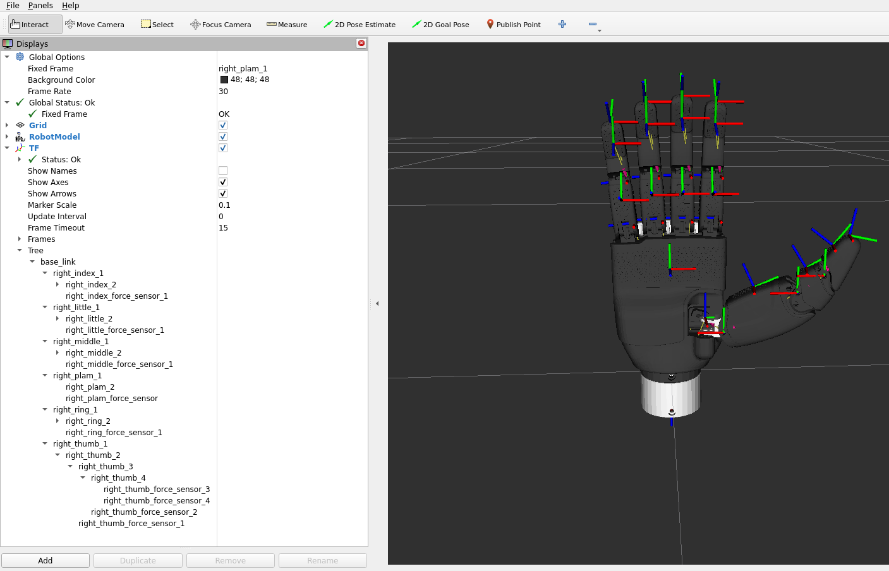
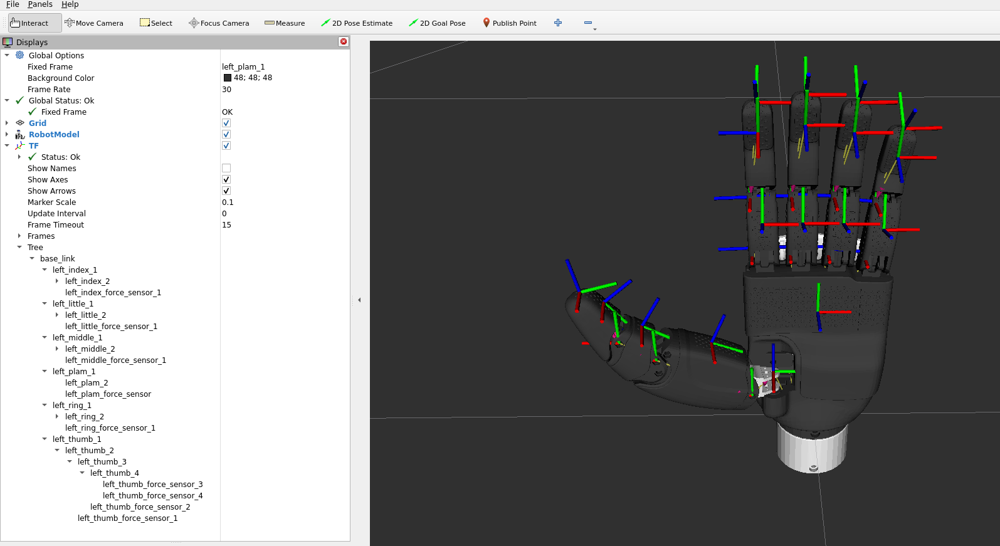

# Inspire Hand Description

ROS2 package containing URDF models and meshes for the Inspire Robotics RH56E2 dexterous hand.

## Features

- Complete URDF models for both left and right hands
- 32 STL meshes per hand (properly named by link)
- 4-segment thumb with correct mimic joint kinematics
- 16 force sensor frames per hand (3 per finger + 1 on palm)
- Proper inertial properties for simulation

## Visualization

| Right Hand | Left Hand |
|------------|-----------|
|  |  |

## Usage

Visualize the hand URDF in RViz:

```bash
ros2 launch inspire_hand_description display.launch.py
```

### Launch Arguments

| Argument | Default | Description |
|----------|---------|-------------|
| `hand`   | `right` | Which hand to display: `right` or `left` |
| `gui`    | `true`  | Show joint_state_publisher_gui |
| `rviz`   | `true`  | Launch RViz |

### Examples

```bash
# Display right hand (default)
ros2 launch inspire_hand_description display.launch.py

# Display left hand
ros2 launch inspire_hand_description display.launch.py hand:=left

# Display without GUI sliders
ros2 launch inspire_hand_description display.launch.py gui:=false
```

## Link Structure

```
base_footprint (root - no inertia)
└── base_link
    ├── palm_1 (fixed) ── palm_2 (fixed)
    │   └── palm_force_sensor
    │
    ├── thumb_1 (revolute)
    │   └── thumb_2 (revolute)
    │       ├── thumb_force_sensor_1
    │       └── thumb_3 (revolute)
    │           ├── thumb_force_sensor_2
    │           └── thumb_4 (revolute, mimic)
    │               ├── thumb_force_sensor_3
    │               └── thumb_force_sensor_4
    │
    ├── index_1 (revolute)
    │   ├── index_force_sensor_1
    │   └── index_2 (revolute, mimic)
    │       ├── index_force_sensor_2
    │       └── index_force_sensor_3
    │
    ├── middle_1 (revolute)
    │   ├── middle_force_sensor_1
    │   └── middle_2 (revolute, mimic)
    │       ├── middle_force_sensor_2
    │       └── middle_force_sensor_3
    │
    ├── ring_1 (revolute)
    │   ├── ring_force_sensor_1
    │   └── ring_2 (revolute, mimic)
    │       ├── ring_force_sensor_2
    │       └── ring_force_sensor_3
    │
    └── little_1 (revolute)
        ├── little_force_sensor_1
        └── little_2 (revolute, mimic)
            ├── little_force_sensor_2
            └── little_force_sensor_3
```

## Joint Names

The following joints are available for control (prefix with `left_` or `right_`):

| Joint | Type | Description |
|-------|------|-------------|
| `thumb_1_joint` | revolute | Thumb base rotation |
| `thumb_2_joint` | revolute | Thumb proximal flexion |
| `thumb_3_joint` | revolute | Thumb middle flexion |
| `thumb_4_joint` | revolute (mimic) | Thumb distal flexion |
| `index_1_joint` | revolute | Index proximal flexion |
| `index_2_joint` | revolute (mimic) | Index distal flexion |
| `middle_1_joint` | revolute | Middle proximal flexion |
| `middle_2_joint` | revolute (mimic) | Middle distal flexion |
| `ring_1_joint` | revolute | Ring proximal flexion |
| `ring_2_joint` | revolute (mimic) | Ring distal flexion |
| `little_1_joint` | revolute | Little proximal flexion |
| `little_2_joint` | revolute (mimic) | Little distal flexion |

**Note:** Mimic joints automatically follow their parent joint - only 6 independent DOF per hand.

## Package Structure

```
inspire_hand_description/
├── config/                 # Joint configuration files
│   ├── joint_names_left.yaml
│   └── joint_names_right.yaml
├── doc/                    # Documentation and images
├── launch/                 # ROS2 launch files
│   └── display.launch.py
├── meshes/                 # STL mesh files (32 per hand)
│   ├── left/
│   └── right/
├── rviz/                   # RViz configuration
│   ├── left.rviz
│   └── right.rviz
└── urdf/                   # URDF model files
    ├── rh56e2_left.urdf
    └── rh56e2_right.urdf
```

## Force Sensors

Each hand includes 16 force sensor frames for tactile feedback:

| Finger | Sensors |
|--------|---------|
| Thumb | 4 (one per segment) |
| Index | 3 |
| Middle | 3 |
| Ring | 3 |
| Little | 3 |
| Palm | 1 |

Force sensor frames are fixed joints attached to their respective link segments.
