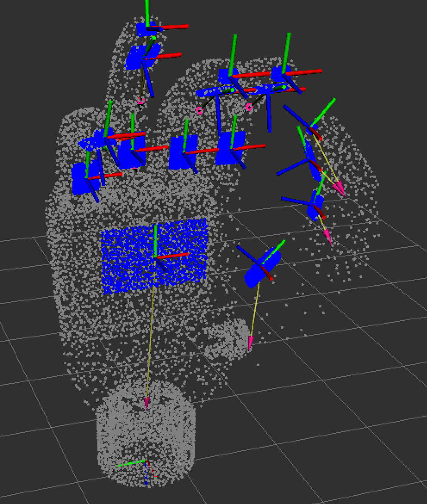

# Inspire Hand ROS2

ROS2 Humble wrapper for the **RH56DFTP Dexterous Hand** by Beijing Inspire-Robots with human-inspired grasp control.

## Features

- **6-DOF Control**: Position, angle, force, and speed control for all fingers
- **1062 Tactile Sensors**: Full tactile feedback from fingertips, finger pads, and palm
- **Human-Inspired Grasping**: Based on Romano et al. (IEEE TRO 2011)
  - Weber's law slip detection (12% threshold)
  - Adaptive force compensation
  - 6-state grasp controller
- **Grasp Presets**: Power, pinch, precision, cylindrical, hook
- **Action Server**: Real-time feedback during grasp operations
- **Dual Visualization**:
  - 2D Qt heatmaps for real-time tactile monitoring
  - 3D point cloud visualization in RViz (~20k points, 16 pts/taxel)

## Hardware Requirements

- RH56DFTP Dexterous Hand
- Ethernet connection (default IP: 192.168.123.211, port: 6000)
- 24V power supply

## Installation

### Prerequisites

```bash
# ROS2 Humble
sudo apt install ros-humble-desktop

# Python dependencies
pip install pymodbus numpy

# For visualizer (optional)
pip install pyqtgraph colorcet PyQt5
```

### Build

```bash
cd ~/develop/inspire_hand_ws
source /opt/ros/humble/setup.bash

# Build the package
colcon build --packages-select inspire_hand_ros2

# Source the workspace
source install/setup.bash
```

## Quick Start

### Launch the Node

```bash
ros2 launch inspire_hand_ros2 inspire_hand.launch.py
```

With custom parameters:

```bash
ros2 launch inspire_hand_ros2 inspire_hand.launch.py \
  hand_ip:=192.168.123.211 \
  default_force:=600
```

### Execute a Grasp

```bash
# Power grasp (closes all fingers)
ros2 service call /inspire_hand/inspire_hand_node/grasp inspire_hand_ros2/srv/Grasp \
  "{grasp_type: 'power', target_force: 300, speed: 0.1}"

# Pinch grasp (thumb + index)
ros2 service call /inspire_hand/inspire_hand_node/grasp inspire_hand_ros2/srv/Grasp \
  "{grasp_type: 'pinch', target_force: 300, speed: 0.1}"

# Release (open hand)
ros2 service call /inspire_hand/inspire_hand_node/release inspire_hand_ros2/srv/Release \
  "{speed: 0.5}"
```

### Grasp with Real-Time Feedback (Action)

Use the action interface for real-time feedback during grasp operations:

```bash
ros2 action send_goal /inspire_hand/inspire_hand_node/grasp_object inspire_hand_ros2/action/GraspObject \
  "{grasp_type: 'power', target_force: 300, speed: 0.1, use_slip_compensation: true, timeout: 30.0}" \
  --feedback
```

The `--feedback` flag streams progress updates including grasp state, elapsed time, and slip detection events.

### Direct Control

```bash
# Set specific angles (0=closed, 1000=open)
ros2 topic pub --once /inspire_hand/inspire_hand_node/control inspire_hand_ros2/msg/InspireHandControl \
  "{angle_set: [500, 500, 500, 500, 500, 500], force_set: [500, 500, 500, 500, 500, 500], speed_set: [500, 500, 500, 500, 500, 500]}"
```

### Monitor Topics

```bash
# Hand state (100 Hz)
ros2 topic echo /inspire_hand/inspire_hand_node/state

# Tactile data (50 Hz)
ros2 topic echo /inspire_hand/inspire_hand_node/touch

# Grasp status
ros2 topic echo /inspire_hand/inspire_hand_node/grasp_status
```

### Visualizers

**2D Qt Visualizer** - Real-time tactile heatmaps and state curves:

```bash
# In a separate terminal (while node is running)
ros2 run inspire_hand_ros2 visualizer.py
```

**3D Tactile Point Cloud** - Spatial visualization in RViz:



```bash
# With real hardware
ros2 launch inspire_hand_ros2 tactile_pointcloud.launch.py

# Standalone simulation
ros2 launch inspire_hand_description display_tactile.launch.py
```

See [Tactile Point Cloud Documentation](../inspire_hand_description/README.md#tactile-point-cloud-visualization) for details.

## ROS2 Interface

**Node name**: `inspire_hand_node`
**Namespace**: `inspire_hand` (default)
**Full path prefix**: `/inspire_hand/inspire_hand_node/`

### Topics

| Topic | Type | Rate | Description |
|-------|------|------|-------------|
| `/inspire_hand/inspire_hand_node/state` | `InspireHandState` | 100 Hz | Actuator feedback (position, angle, force, status) |
| `/inspire_hand/inspire_hand_node/touch` | `InspireHandTouch` | 50 Hz | Tactile sensor data (1062 values) |
| `/inspire_hand/inspire_hand_node/control` | `InspireHandControl` | - | Control commands (subscriber) |
| `/inspire_hand/inspire_hand_node/grasp_status` | `GraspStatus` | 50 Hz | Grasp controller state |

### Services

| Service | Type | Description |
|---------|------|-------------|
| `/inspire_hand/inspire_hand_node/grasp` | `Grasp` | Execute grasp preset |
| `/inspire_hand/inspire_hand_node/release` | `Release` | Release and open hand |
| `/inspire_hand/inspire_hand_node/set_finger_position` | `SetFingerPosition` | Direct finger control |
| `/inspire_hand/inspire_hand_node/get_state` | `GetHandState` | Get current state snapshot |

### Actions

| Action | Type | Description |
|--------|------|-------------|
| `/inspire_hand/inspire_hand_node/grasp_object` | `GraspObject` | Grasp with real-time feedback |

## Parameters

| Parameter | Type | Default | Description |
|-----------|------|---------|-------------|
| `hand_ip` | string | `192.168.123.211` | Hand IP address |
| `hand_port` | int | `6000` | Modbus TCP port |
| `device_id` | int | `1` | Hand device ID (1-254) |
| `state_rate` | double | `100.0` | State publish rate (Hz) |
| `touch_rate` | double | `50.0` | Tactile publish rate (Hz) |
| `enable_tactile` | bool | `true` | Enable tactile reading |
| `default_force` | int | `500` | Default grip force (grams) |
| `default_speed` | int | `500` | Default movement speed (0-1000) |
| `slip_compensation` | bool | `true` | Enable slip detection |
| `namespace` | string | `inspire_hand` | Node namespace |

## Grasp Presets

| Preset | Description | Finger Configuration |
|--------|-------------|----------------------|
| `power` | Full hand power grasp | All fingers closed (angle=0) |
| `pinch` | Thumb-index pinch | Index + thumb closed, others open |
| `precision` | Three-finger precision | Middle, index, thumb closed |
| `cylindrical` | Wrapped grasp | Partially closed wrap |
| `hook` | Four-finger hook | 4 fingers closed, thumb open |
| `open` | Fully open hand | All fingers extended (angle=1000) |

**Note**: angle=0 is CLOSED (fingers curled), angle=1000 is OPEN (fingers extended)

## Message Definitions

### InspireHandState.msg

```
std_msgs/Header header
int16[6] position_actual      # Actuator position (0-2000)
int16[6] angle_actual         # Finger angle (0-1000)
int16[6] force_actual         # Grip force in grams (-4000 to 4000)
int16[6] current              # Motor current in mA
uint8[6] status               # Status codes (0-7)
uint8[6] error                # Error bitfield
uint8[6] temperature          # Temperature in Celsius
```

**Status Codes:**
- `0`: Releasing
- `1`: Grasping
- `2`: Position reached
- `3`: Force reached (object grasped)
- `5`: Current protection
- `6`: Stall
- `7`: Fault

### InspireHandControl.msg

```
std_msgs/Header header
int16[6] angle_set            # Target angle (0-1000, -1=no change)
int16[6] force_set            # Force limit in grams (0-3000)
int16[6] speed_set            # Speed (0-1000, -1=no change)
```

### GraspObject.action

```
# Goal
string grasp_type             # Preset name or "custom"
int16 target_force            # Force in grams (0-3000, default 500)
int16[6] custom_angles        # For custom grasps
float32 speed                 # 0.0-1.0 (default 0.5)
bool use_slip_compensation    # Enable slip response (default true)
float32 slip_threshold        # Weber's law threshold (0.0-1.0, default 0.12 = 12%)
float32 timeout               # Timeout in seconds (default 10.0)
---
# Result
bool success
string message
int16[6] final_force
uint8[6] final_status
float32 elapsed_time
---
# Feedback
GraspStatus status
float32 progress              # 0.0 to 1.0
float32 elapsed_time
```

## Finger Indices

| Index | Finger | Angle Range |
|-------|--------|-------------|
| 0 | Little | 0-1000 (20°-176°) |
| 1 | Ring | 0-1000 (20°-176°) |
| 2 | Middle | 0-1000 (20°-176°) |
| 3 | Index | 0-1000 (20°-176°) |
| 4 | Thumb bend | 0-1000 (-13°-70°) |
| 5 | Thumb rotate | 0-1000 (90°-165°) |

## Grasp Controller

The grasp controller implements a human-inspired finite state machine based on Romano et al. (IEEE TRO 2011).

### State Machine

```
                    start_grasp()
                         │
                         ▼
┌──────────┐       ┌──────────┐    contact     ┌──────────┐
│   IDLE   │──────►│ CLOSING  │───────────────►│ LOADING  │
└──────────┘       └──────────┘                └────┬─────┘
     ▲                                              │
     │                                    stable_contact (2+ fingers)
     │                                              │
     │                                         ┌────▼─────┐
     │                                         │ HOLDING  │◄────┐
     │                                         └────┬─────┘     │
     │                                              │           │
     │                                         slip_detected    │
     │                                              │           │
     │                                         ┌────▼─────┐     │
     │    release()                            │   SLIP   │─────┘
     │       │                                 │ DETECTED │ (adjust force + angles)
     │       │                                 └──────────┘
     │       │
┌────┴───────┴─┐     force=0     ┌──────────┐    place()   ┌──────────┐
│   OPENING    │◄────────────────│ UNLOADING│◄─────────────│ REPLACING│
└──────────────┘                 └──────────┘              └──────────┘
```

### Slip Detection Algorithm

Slip detection uses **Weber's Law** with additional safeguards adapted for the Inspire Hand's high-sensitivity tactile sensors:

```
SLIP = (Weber condition) AND (Force stable) AND (Derivative above minimum)
```

**Three conditions must ALL be true:**

1. **Weber's Law** (from Romano et al.):
   ```
   |d(tactile)/dt| > tactile_sum × slip_threshold
   ```
   - Default `slip_threshold = 0.12` (12%)
   - Configurable via action goal parameter

2. **Force Stability Check**:
   ```
   band_pass_force < force_stability_threshold
   ```
   - Band-pass filter (1-5 Hz) removes DC and high-frequency noise
   - Prevents feedback loop: when grip force changes, tactile changes too
   - If force is actively being adjusted, ignore slip signals

3. **Minimum Derivative Threshold**:
   ```
   |d(tactile)/dt| > min_derivative_for_slip
   ```
   - Default `min_derivative_for_slip = 50000`
   - Inspire Hand tactile sensors are very sensitive (derivatives 10,000-200,000)
   - Filters out normal sensor noise during stable grasp

### Slip Compensation Response

When slip is detected, the controller:

1. **Increases force** by 5%:
   ```python
   new_force = current_force × 1.05
   ```

2. **Closes fingers more** by reducing angles:
   ```python
   new_angle = current_angle - SLIP_ANGLE_STEP  # SLIP_ANGLE_STEP = 100
   ```
   - angle=0 is CLOSED, angle=1000 is OPEN
   - Subtracting makes fingers grip tighter

3. **Sends both** new angles AND new force to hardware

### Timing Parameters

| Parameter | Value | Purpose |
|-----------|-------|---------|
| `INITIAL_HOLD_DELAY` | 1.0s | Wait after entering HOLD before enabling slip detection (lets tactile filters settle) |
| `SLIP_COOLDOWN` | 0.5s | Minimum time between slip responses (prevents oscillation) |
| `SLIP_ANGLE_STEP` | 100 | Angle reduction per slip (~10% of full range) |

### Why Both Force AND Angle?

The Inspire Hand uses **hardware force limiting**: when `FORCE_SET[i]` is reached, the finger stops moving. Simply increasing the force limit doesn't restart finger movement if the finger already stopped.

To make the hand grip tighter on slip:
- **Increase force limit**: Allows more grip strength
- **Decrease angle target**: Commands finger to close more, restarting movement toward the object

### Tactile Signal Processing

Two signal types (inspired by human mechanoreceptors):

| Signal | Human Analog | Computation | Purpose |
|--------|--------------|-------------|---------|
| **SA-I** | Merkel cells | Sum of tactile values | Steady-state contact force |
| **FA-I** | Meissner corpuscles | High-pass filtered tactile (5 Hz) | Force disturbances / slip |

The FA-I signal (derivative) is used for slip detection because it responds to changes while ignoring steady contact.

## Python API Example

```python
import rclpy
from rclpy.node import Node
from inspire_hand_ros2.msg import InspireHandControl, InspireHandState
from inspire_hand_ros2.srv import Grasp

class GraspExample(Node):
    def __init__(self):
        super().__init__('grasp_example')

        # Subscribe to state
        self.state_sub = self.create_subscription(
            InspireHandState,
            '/inspire_hand/inspire_hand_node/state',
            self.state_callback,
            10
        )

        # Service client
        self.grasp_client = self.create_client(
            Grasp, '/inspire_hand/inspire_hand_node/grasp'
        )

    def state_callback(self, msg):
        # Check if any finger reached force threshold
        for i, status in enumerate(msg.status):
            if status == 3:  # Force reached
                self.get_logger().info(f'Finger {i} grasping object')

    async def execute_grasp(self):
        request = Grasp.Request()
        request.grasp_type = 'precision'
        request.target_force = 300
        request.speed = 0.1
        request.use_slip_compensation = True

        result = await self.grasp_client.call_async(request)
        return result.success
```

## Tactile Sensor Layout

**Hardware Data Format**:
- Each taxel: 16-bit integer (2 bytes, little-endian)
- Value range: 0-4095 (12-bit ADC)

**Sensor Distribution** (1062 total):

| Region | Grid | Taxels | Bytes |
|--------|------|--------|-------|
| Finger Tip | 3×3 | 9 | 18 |
| Finger Nail | 12×8 | 96 | 192 |
| Finger Pad | 10×8 | 80 | 160 |
| Thumb Tip | 3×3 | 9 | 18 |
| Thumb Nail | 12×8 | 96 | 192 |
| Thumb Middle | 3×3 | 9 | 18 |
| Thumb Pad | 12×8 | 96 | 192 |
| Palm | 8×14 | 112 | 224 |

**Per-finger totals**:
- Index/Middle/Ring/Little: 185 taxels (370 bytes)
- Thumb: 210 taxels (420 bytes)
- Palm: 112 taxels (224 bytes)

**Grand Total: 4×185 + 210 + 112 = 1062 taxels (2124 bytes)**

### Hardware Indexing

**Standard (all fingers/thumb):** Row-major ordering
```
index = row * cols + col
```
- Data Point 1 → row 0, col 0
- Data Point 2 → row 0, col 1
- Data Point N → row 0, col (N-1)

**Palm (special case):** Column-major with reversed rows
```
index = col * 8 + (7 - row)
```
- Data Point 1 → row 7, col 0 (bottom-left)
- Data Point 8 → row 0, col 0 (top-left)
- Data Point 9 → row 7, col 1 (bottom, next column)

This unique indexing requires special handling in the point cloud mapper.

## Tactile Point Cloud Architecture

The 3D tactile visualization is built from three modules that work together:

```
┌─────────────────┐     ┌───────────────────┐     ┌────────────────┐
│  mesh_sampler   │────►│ kinematics_solver │────►│ tactile_mapper │
│                 │     │                   │     │                │
│ Load STL meshes │     │ Compute FK from   │     │ Map 1062 taxels│
│ Sample points   │     │ joint angles      │     │ to point colors│
└─────────────────┘     └───────────────────┘     └────────────────┘
        │                        │                        │
        ▼                        ▼                        ▼
   MeshPoints              4x4 Transforms            RGB Colors
   (local frame)           (world frame)           (per point)
```

### mesh_sampler.py

**Purpose**: Load URDF, extract STL meshes, sample points uniformly on surfaces.

**How it works**:
1. Parses URDF to find all links with visual meshes
2. Resolves `package://` URIs to absolute file paths
3. Loads each STL file using `trimesh`
4. Samples points using `trimesh.sample.sample_surface_even()`
5. Returns points in each link's local coordinate frame

**Key configuration**:
- `points_per_taxel`: Points sampled per tactile sensor (default: 16)
- Tactile meshes: `num_taxels × points_per_taxel` points
- Non-tactile meshes: 200 points (gray, for context)

**Output**: `Dict[link_name, MeshPoints]` where each `MeshPoints` contains:
- `points_local`: (N, 3) array of XYZ positions
- `normals_local`: (N, 3) array of surface normals
- `tactile_region`: Region name (e.g., "thumb_tip") or None

### kinematics_solver.py

**Purpose**: Compute forward kinematics to transform points from link frames to world frame.

**How it works**:
1. Parses URDF to build kinematic tree (joints, origins, axes)
2. Maps 6-DOF `angle_actual` (0-1000) to URDF joint angles (radians)
3. Handles mimic joints (distal joints follow proximal)
4. Computes 4×4 transform matrices using DFS from `base_footprint`

**Joint mapping** (InspireHandState index → URDF joint):
| DOF | Finger | URDF Joint |
|-----|--------|------------|
| 0 | Little | `right_little_1_joint` |
| 1 | Ring | `right_ring_1_joint` |
| 2 | Middle | `right_middle_1_joint` |
| 3 | Index | `right_index_1_joint` |
| 4 | Thumb bend | `right_thumb_2_joint` |
| 5 | Thumb rotate | `right_thumb_1_joint` |

**Mimic joints** (computed automatically):
- `thumb_3 = thumb_2 × 0.8392`
- `thumb_4 = thumb_3 × 0.891`
- `finger_2 = finger_1 × 1.0843` (for all fingers)

**Output**: `Dict[link_name, np.ndarray(4,4)]` - transform matrices

### tactile_mapper.py

**Purpose**: Map 1062 tactile sensor values to mesh point colors.

**How it works**:

1. **Initialization**: Divides each tactile mesh into grid zones matching hardware sensor layout
   - All regions use XY projection in local link frame: `coords = points[:, [0, 1]]`
   - X axis (left-right) → columns, Y axis (proximal-distal) → rows
   - Applies `flip_rows=True` to all regions (row 0 = proximal/top)

2. **Grid mapping**: Normalizes mesh coordinates to [0, 1] and maps to grid indices
   ```python
   col_indices = normalized_x * cols
   row_indices = (rows - 1) - (normalized_y * rows)  # Flipped
   ```

3. **Indexing formulas**:
   - **Fingers/Thumb** (row-major): `index = row * cols + col`
   - **Palm** (column-major): `index = col * rows + row`

4. **Special cases**:
   - **Palm**: Uses column-major indexing (see Hardware Indexing above)
   - **Thumb middle**: Applies `flip_cols=True` due to URDF joint rotation mirroring X axis

5. **Runtime**: For each tactile message
   - Looks up which grid cell each mesh point belongs to
   - Gets tactile value for that cell's sensor
   - Converts to RGB color using heatmap (Blue=0 → Red=4095)

**Color mapping** (0-4095 → RGB):
```
Value    Color    Normalized
0        Blue     0%
1024     Cyan     25%
2048     Green    50%
3072     Yellow   75%
4095     Red      100%
```

**Key insight**: Each of the 1062 sensors maps to ~16 mesh points, giving equal visual weight per sensor regardless of physical size.

### tactile_pointcloud_node.py

**Purpose**: ROS2 node coordinating all components at 50 Hz.

**Data flow**:
1. Subscribe to `/inspire_hand/inspire_hand_node/state` (joint angles)
2. Subscribe to `/inspire_hand/inspire_hand_node/touch` (tactile data)
3. Compute FK transforms for current joint angles
4. Transform all mesh points to world frame
5. Apply tactile colors to points
6. Publish `PointCloud2` to `/inspire_hand/tactile_pointcloud`
7. Publish `JointState` to `/joint_states` (for RViz robot model)

**Parameters**:
| Parameter | Default | Description |
|-----------|---------|-------------|
| `points_per_taxel` | 16 | Sampling density |
| `colormap_min` | 0 | Min tactile value |
| `colormap_max` | 4095 | Max tactile value |
| `publish_rate` | 50.0 | Hz |

## Troubleshooting

### Connection Issues

```bash
# Check network connectivity
ping 192.168.123.211

# Verify port is open
nc -zv 192.168.123.211 6000
```

### Hand Not Responding

The driver runs calibration on startup. If a finger isn't moving:

```bash
# Get current state to check status/errors
ros2 service call /inspire_hand/inspire_hand_node/get_state inspire_hand_ros2/srv/GetHandState "{}"

# Or restart the node to re-run calibration
```

### Finger Not Moving

If a specific finger doesn't respond after startup, the calibration may need to be re-run. Restart the node or power cycle the hand.

### Slow Tactile Updates

Reduce tactile rate if bandwidth limited:

```bash
ros2 launch inspire_hand_ros2 inspire_hand.launch.py touch_rate:=20.0
```

### Visualizer Not Showing Data

Make sure the main node is running and publishing:
```bash
ros2 topic hz /inspire_hand/inspire_hand_node/state
ros2 topic hz /inspire_hand/inspire_hand_node/touch
```

## References

1. **Hardware**: RH56DFTP User Manual v1.0.0, Beijing Inspire-Robots
2. **Grasp Algorithm**: Romano, Hsiao, Niemeyer, Chitta, Kuchenbecker, "Human-Inspired Robotic Grasp Control With Tactile Sensing", IEEE Transactions on Robotics, 2011